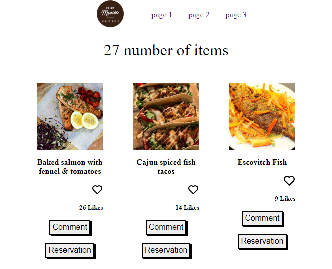

# JavaScript-Capstone


# JavaScript Capstone Project

> Recipe Application
> This application show a list of recipe with details and option to make like for any recipe you want.

## Built With

- HTML&CSS
- VScode 
- JS

## Technologies

- webpack.
- JS6 Module.

## Live Demo 

Go to live demo : 
https://maenkhraisha.github.io/JavaScript-Capstone/



## out resourse
In this application we have use the follwing API
API link (https://www.themealdb.com/api.php)

## Getting Started

**First open VS code**<br/>
**From the VS code terminal navigate to the folder where you want to download the project**<br/>
```
$ git clone git@github.com:maen1980/JavaScript-Capstone.git
```
use npm install
use npm start


### Prerequisites
VScode


## Authors

👤 **Maen Al-khraisha**

- GitHub: [@githubhandle](https://github.com/maen1980)
- Twitter: [@twitterhandle](https://twitter.com/AlkhryshaM)
- LinkedIn: [LinkedIn](https://www.linkedin.com/in/ma-en-mohammad-303930100/)


## 🤝 Contributing

Contributions, issues, and feature requests are welcome!

Feel free to check the [issues page](../../issues/).

## Show your support

Give a ⭐️ if you like this project!

## Acknowledgments


## 📝 License

This project is [MIT](./MIT.md) licensed.
